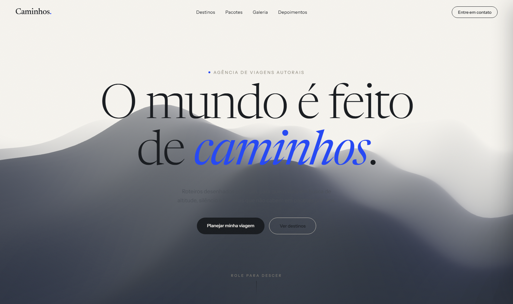
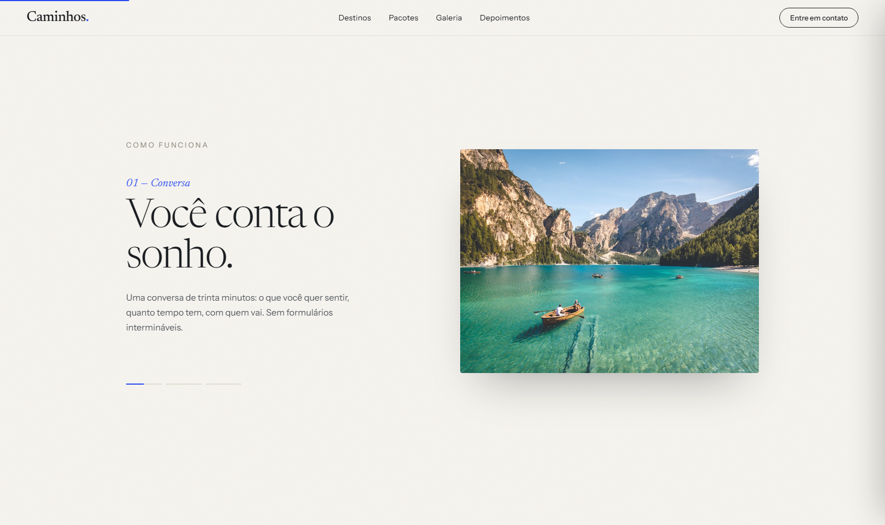
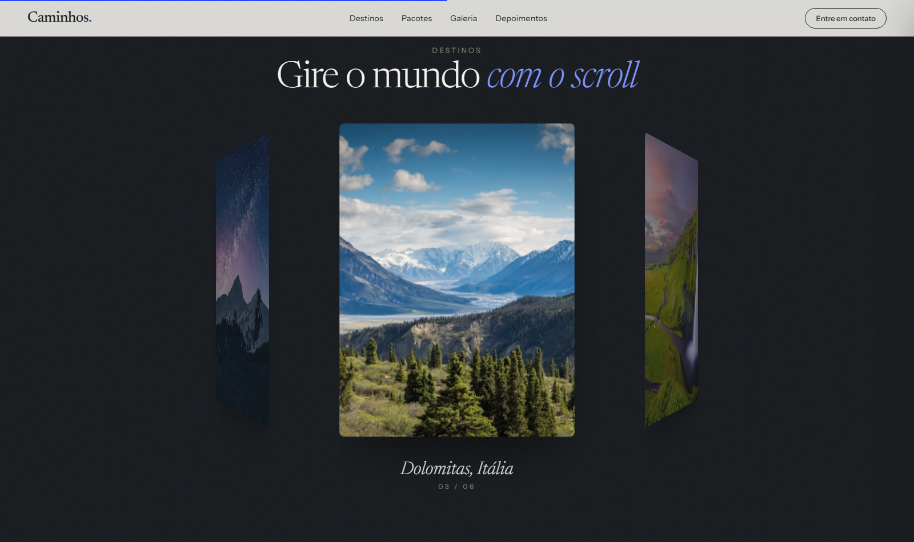
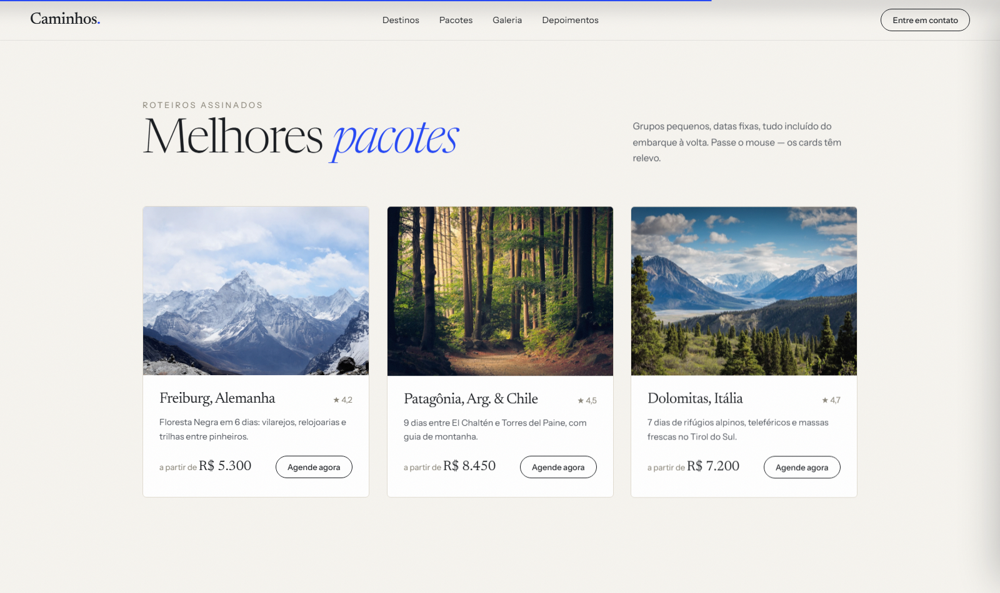
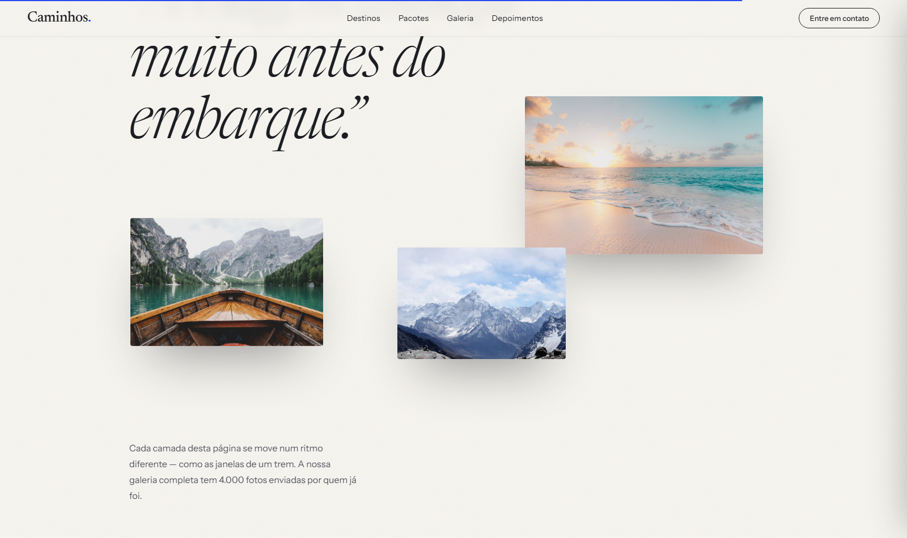
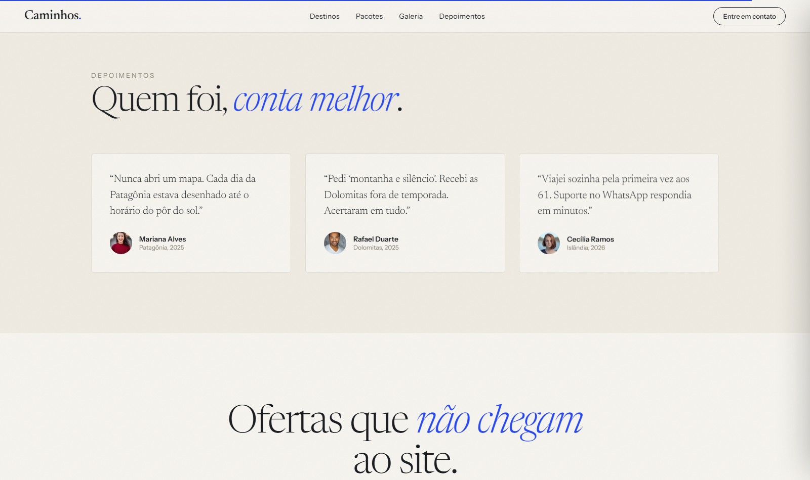
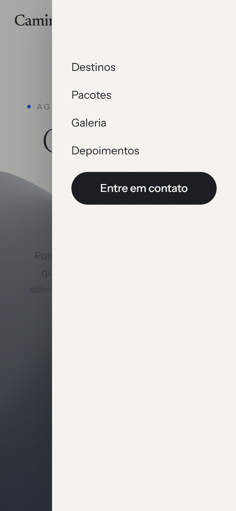

# Caminhos

Site editorial para uma agência de viagens autorais, construído em React + TypeScript + Vite, com uma cena 3D animada em Three.js, scroll storytelling (seções "pinadas") e um carrossel 3D de destinos.



## Visão geral

**Caminhos** é uma landing page de uma única página (`src/App.tsx`), toda em português, com identidade visual creme/tinta, tipografia serifada (Newsreader) combinada com uma sans-serif (Instrument Sans), e uma sequência de seções que contam a história da marca através do scroll.

Não há backend: os "dados" de cada seção (destinos, pacotes, depoimentos, passos do processo) são arrays estáticos no topo de `App.tsx`, prontos para serem trocados por conteúdo real.

## Principais funcionalidades

- **Hero 3D animado** — terreno low-poly ondulando em Three.js, com névoa, parallax de mouse e reação ao scroll (`src/components/HeroScene.tsx`).
- **"Como funciona" com scroll pinado** — a seção fica fixa na tela enquanto o usuário rola, alternando entre 3 passos com fade/translate sincronizados ao progresso do scroll.
- **Carrossel 3D de destinos** — um anel de cards em `transform: rotateY()` gira conforme o scroll, com perspectiva e brilho variando por card.
- **Contadores animados** — números que sobem com easing cúbico quando entram na tela (`useCounter`).
- **Galeria com parallax** — cada imagem se move numa velocidade diferente ao rolar a página.
- **Cards com tilt 3D no hover** — pacotes e depoimentos inclinam-se sutilmente seguindo o cursor do mouse.
- **Totalmente responsivo** — menu mobile com painel deslizante, grids que colapsam para 1 coluna, e o carrossel/tipografia escalam via `clamp()` para caber em qualquer largura de tela.
- **Newsletter funcional (client-side)** — validação simples de e-mail com mensagem de confirmação.

## Tour visual

| Hero (cena 3D) | Como funciona (scroll pinado) |
|---|---|
|  |  |

| Destinos (carrossel 3D) | Pacotes |
|---|---|
|  |  |

| Galeria (parallax) | Depoimentos |
|---|---|
|  |  |

| Mobile — hero | Mobile — menu |
|---|---|
|  |  |

## Stack

- **React 18** + **TypeScript** — componentes funcionais, sem gerenciador de estado externo (tudo é `useState`/`useRef` local).
- **Vite** — dev server e build.
- **Three.js** — cena 3D do hero.
- **CSS puro** (`src/index.css`) — variáveis CSS para o design system, sem framework de utilitários.
- Toda a animação (reveal on scroll, tilt, parallax, contadores, progresso de scroll pinado) é feita com hooks próprios em `src/hooks/hooks.ts`, sem biblioteca de animação.

## Estrutura do projeto

```
src/
├── App.tsx              # todas as seções da página (Nav, Hero, Stats, HowItWorks,
│                         # DestinationsRing, Packages, Gallery, Testimonials,
│                         # Newsletter, Footer) e os dados estáticos de cada uma
├── main.tsx              # entrypoint do React
├── index.css             # design tokens (cores, fontes) + estilos globais/responsivos
├── components/
│   └── HeroScene.tsx      # cena three.js do terreno animado no hero
└── hooks/
    └── hooks.ts           # useReveal, useTilt, useCounter, useParallax, usePinProgress
```

## Rodando localmente

Requer Node 20+.

```bash
npm install
npm run dev       # servidor de desenvolvimento (http://localhost:5173)
npm run build     # build de produção em dist/
npm run preview   # serve o build de produção localmente
```

## Deploy

O projeto está configurado para deploy estático no Netlify (`netlify.toml`): `npm run build` gera `dist/`, que é publicado diretamente.

## Licença

MIT — veja [LICENSE](LICENSE).
